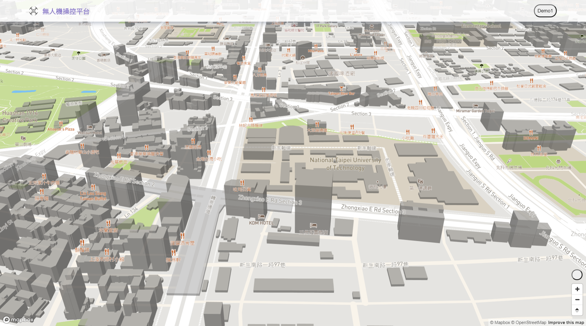

# 4G無人機 雲端操控平台

**平台連結**:[https://waiting33118.github.io/drone-cloud-platform/](https://waiting33118.github.io/drone-cloud-platform/)

## 目前功能

- 定位使用者位置(建議使用手機，GPS訊號較準)
- 模擬飛行路徑(未來功能: 即時路徑顯示、歷史飛行紀錄)

## 未來待開發功能

- 即時影像串流
- 導入vue框架 + vuetify(模板) [範例連結](https://demos.creative-tim.com/vuetify-material-dashboard-pro/?ref=vuetifyjs.com&partner=116160#/)